<h2>
EfficientNet Mammography (Updated: 2022/11/06)
</h2>
<a href="#1">1 EfficientNetV2 Mammography Classification </a> 
<a href="#1.1">1.1 Clone repository</a> 
<a href="#1.2">1.2 Install Python packages</a> 
<a href="#2">2 Python classes for Mammography Classification</a> 
<a href="#3">3 Pretrained model</a> 
<a href="#4">4 Train</a> 
<a href="#4.1">4.1 Train script</a> 
<a href="#4.2">4.2 Training result</a> 
<a href="#5">5 Inference</a> 
<a href="#5.1">5.1 Inference script</a> 
<a href="#5.2">5.2 Sample test images</a> 
<a href="#5.3">5.3 Inference result</a> 
<a href="#6">6 Evaluation</a> 
<a href="#6.1">6.1 Evaluation script</a> 
<a href="#6.2">6.2 Evaluation result</a> 

<h2>
<a id="1">1 EfficientNetV2 Mammography Classification</a>
</h2>

This is an experimental project Mammography Classification based on <b>efficientnetv2</b> in <a href="https://github.com/google/automl">Brain AutoML</a>
The Mammography dataset used here has been taken from the following web site: 
 <a href="https://data.mendeley.com/datasets/ywsbh3ndr8/5">Dataset of Breast mammography images with Masses (License: CC BY 4.0)</a>
 
 

 We use python 3.8 and tensorflow 2.8.0 environment on Windows 11 for this project. 
 
   
<h3>
<a id="1.1">1.1 Clone repository</a>
</h3>
 Please run the following command in your working directory: 
<pre>
git clone https://github.com/atlan-antillia/EfficientNet-Mammography.git
</pre>
You will have the following directory tree: 
<pre>
.
├─asset
└─projects
    └─DDSM_Mammography
        ├─DDSM_Images
        │  ├─test
        │  │  ├─Benign Masses
        │  │  └─Malignant Masses
        │  └─train
        │      ├─Benign Masses
        │      └─Malignant Masses
        ├─eval
        ├─evaluation
        ├─inference
        ├─models
        └─test
</pre>
<h3>
<a id="1.2">1.2 Prepare DDSM_Images dataset</a>
</h3>
 Please download Mammography dataset from the following web site: 
 <a href="https://data.mendeley.com/datasets/ywsbh3ndr8/5">Dataset of Breast mammography images with Masses (License:CC BY 4.0)</a> 
 It contains the following three types dataset. 
 <pre>
 DDSM Dataset
 INbreast Dataset
 INbreast+MIAS+DDSM Dataset
 </pre>
 We have created <b>DDSM_Image</b> dataset from <b>DDSM Dataset</b> 
 by using <a href="./projects/DDSM_Mammography/split_master.py">split_master.py</a> script. 
 By our preliminary experiment,  we could not train the Mammography EfficientNetV2 FineTuning Model well by using <b>INbreast Dataset</b>.
 
The number of images of train and test image dataset: 
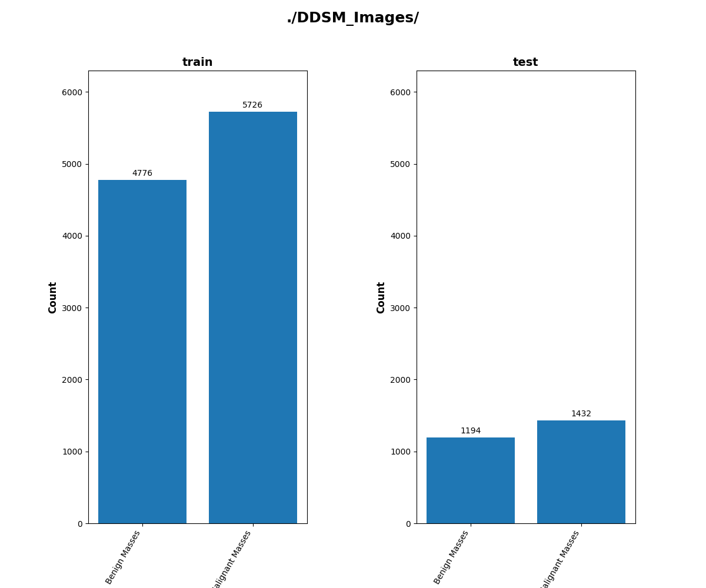
 
 
1 Sample images in DDSM_Images/train/Benign Masses: 
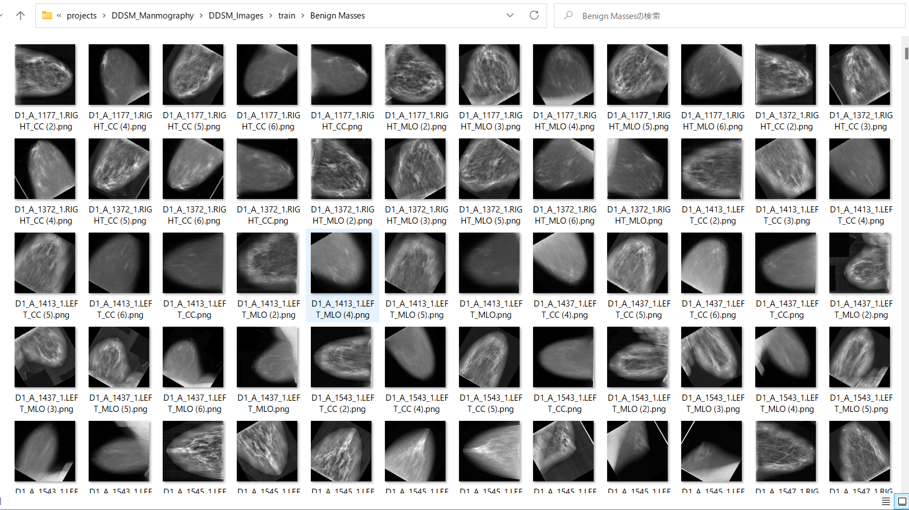  

2 Sample images in DDSM_Images/train/Malignant Masses: 
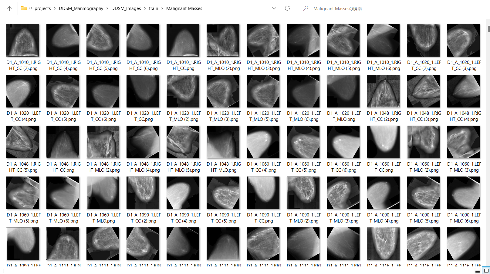  

<h3>
<a id="1.3">1.3 Install Python packages</a>
</h3>

Please run the following commnad to install Python packages for this project. 
<pre>
pip install -r requirements.txt
</pre>
 

<h2>
<a id="2">2 Python classes for Mammography Classification</a>
</h2>
We have defined the following python classes to implement our Mammography Classification. 

<li>
<a href="./ClassificationReportWriter.py">ClassificationResportWriter</a>
</li>
<li>
<a href="./ConfusionMatrix.py">ConfusionMatrix</a>
</li>
<li>
<a href="./CustomDataset.py">CustomDataset</a>
</li>
<li>
<a href="./EpochChangeCallback.py">EpochChangeCallback</a>
</li>
<li>
<a href="./FineTuningModel.py">FineTuningModel</a>
</li>
<li>
<a href="./EfficientNetV2Evaluator.py">EfficientNetV2Evaluator</a>
</li>

<li>
<a href="./EfficientNetV2ModelTrainer.py">EfficientNetV2ModelTrainer</a>
</li>

<li>
<a href="./EfficientNetV2Inferencer.py">EfficientNetV2Inferencer</a>
</li>
<li>
<a href="./TestDataset.py">TestDataset</a>
</li>
 

<h2>
<a id="3">3 Pretrained model</a>
</h2>
 We have used pretrained <b>efficientnetv2-b0</b> to train Mammography Classification Model by using
 the dataset <b>./projects/DDSM_Mammography/DDSM_Images/train</b>.

  
Please download the pretrained checkpoint file from <a href="https://storage.googleapis.com/cloud-tpu-checkpoints/efficientnet/v2/efficientnetv2-b0.tgz">efficientnetv2-b0.tgz</a>, expand it, and place the model under our top repository.

<pre>
.
├─asset
├─efficientnetv2-b0
└─projects
    └─DDSM_Mammography
</pre>

<h2>
<a id="4">4 Train</a>
</h2>
<h3>
<a id="4.1">4.1 Train script</a>
</h3>
Please run the following bat file to train our Mammography efficientnetv2-b0 model by 
using  the dataset <b>./projects/DDSM_Mammography/DDSM_Images/train</b>.
 
<pre>
./1_train.bat
</pre>
<pre>
rem 1_train.bat
python ../../EfficientNetV2ModelTrainer.py ^
  --model_dir=./models ^
  --model_name=efficientnetv2-b0  ^
  --data_generator_config=./data_generator.config ^
  --ckpt_dir=../../efficientnetv2-b0/model ^
  --optimizer=adam ^
  --image_size=224 ^
  --eval_image_size=224 ^
  --data_dir=./DDSM_Images/train ^
  --model_dir=./models ^
  --data_augmentation=True ^
  --valid_data_augmentation=True ^
  --fine_tuning=True ^
  --monitor=val_loss ^
  --learning_rate=0.0002 ^
  --trainable_layers_ratio=0.4 ^
  --dropout_rate=0.4 ^
  --num_epochs=80 ^
  --batch_size=16 ^
  --patience=10 ^
  --debug=True  
</pre>
,where data_generator.config is the following 
<pre>
; data_generation.config

[training]
validation_split   = 0.2
featurewise_center = False
samplewise_center  = False
featurewise_std_normalization=False
samplewise_std_normalization =False
zca_whitening                =False
rotation_range     = 30
horizontal_flip    = True
vertical_flip      = True
 
width_shift_range  = 0.2
height_shift_range = 0.2
shear_range        = 0.01
zoom_range         = [0.6, 2.0]
data_format        = "channels_last"
[validation]
validation_split   = 0.2
featurewise_center = False
samplewise_center  = False
featurewise_std_normalization=False
samplewise_std_normalization =False
zca_whitening                =False
rotation_range     = 30
horizontal_flip    = True
vertical_flip      = True
width_shift_range  = 0.2
height_shift_range = 0.2
shear_range        = 0.01
zoom_range         = [0.6, 2.0]
data_format        = "channels_last"
</pre>

This will generate a <b>best_model.h5</b> in the models folder specified by --model_dir parameter. 
Furthermore, it will generate a <a href="./projects/DDSM_Mammography/eval/train_accuracies.csv">train_accuracies</a>
and <a href="./projects/DDSM_Mammography/eval/train_losses.csv">train_losses</a> files
 
<h3>
<a id="4.2">Training result</a>
</h3>

Training console output: 

 
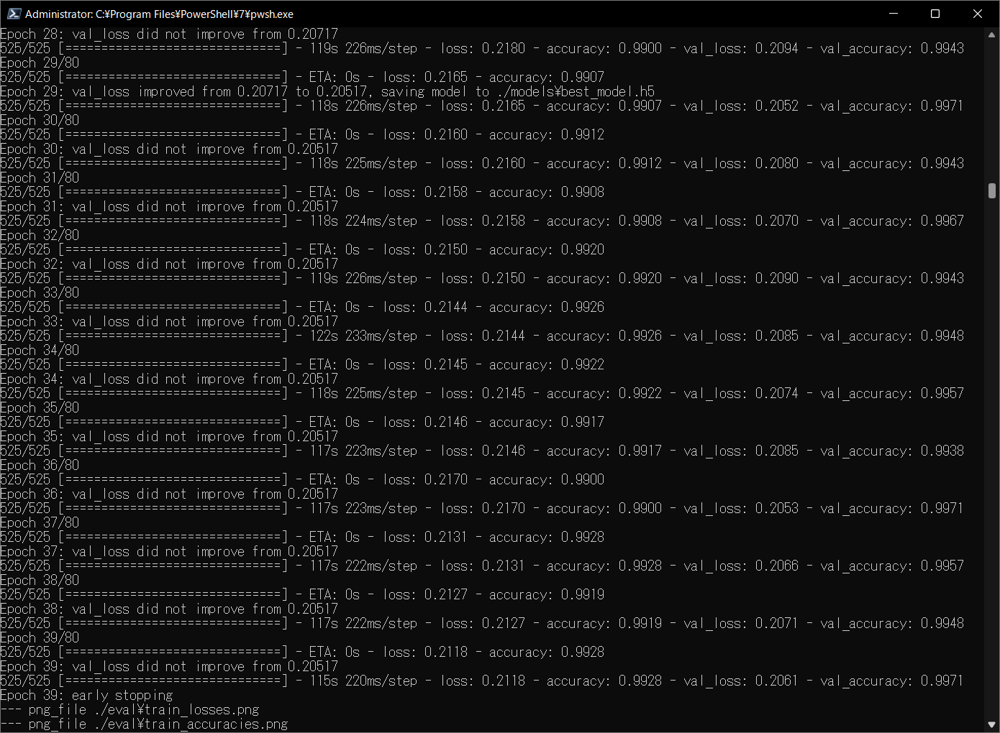 

As shown above, please note that the <b>best_model.h5</b> has been saved at epoch 17.
 
 
Train_accuracies: 
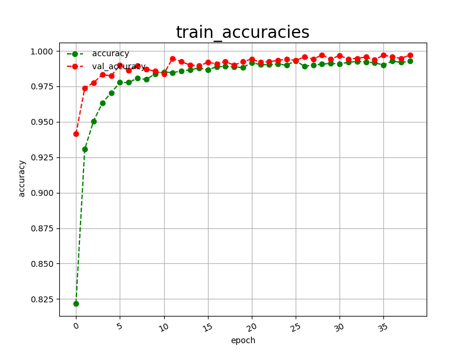 

 
Train_losses: 
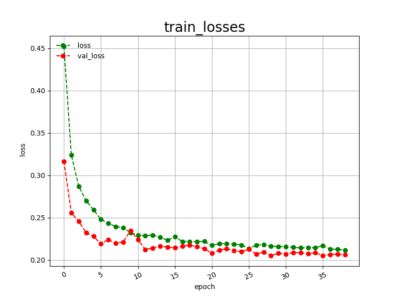 

 

<h2>
<a id="5">5 Inference</a>
</h2>
<h3>
<a id="5.1">5.1 Inference script</a>
</h3>
Please run the following bat file to infer the Mammography test images by the model generated by the above train command. 
<pre>
./2_inference.bat
</pre>
<pre>
rem 2_inference.bat
python ../../EfficientNetV2Inferencer.py ^
  --model_name=efficientnetv2-b0  ^
  --model_dir=./models ^
  --fine_tuning=True ^
  --trainable_layers_ratio=0.4 ^
  --dropout_rate=0.4 ^
  --image_path=./test/*.png ^
  --eval_image_size=224 ^
  --label_map=./label_map.txt ^
  --mixed_precision=True ^
  --infer_dir=./inference ^
  --debug=False 
</pre>
, where label_map.txt is the following: 
<pre>
Benign Masses
Malignant Masses
</pre>
 

<h3>
<a id="5.2">5.2 Sample test images</a>
</h3>

Sample test images generated by <a href="./projects/Mammography/create_test_dataset.py">create_test_dataset.py</a> 
from <a href="./projects/DDSM_Mammography/DDSM_Images/test">DDSM_Images/test</a>.
Mammography/test: 
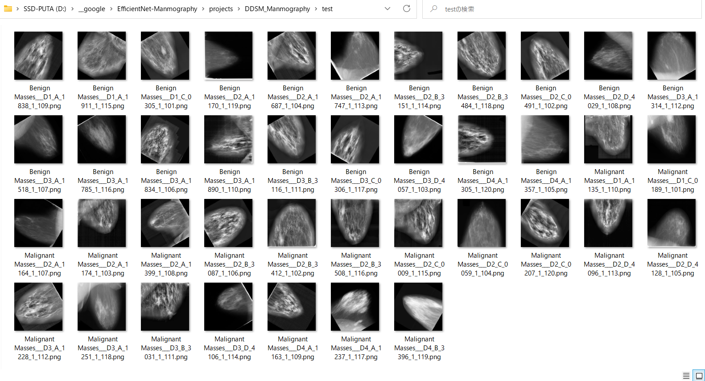
  

<h3>
<a id="5.3">5.3 Inference result</a>
</h3>

This inference command will generate <a href="./projects/Mammography/inference/inference.csv">inference result file</a>.
 
Inference console output: 
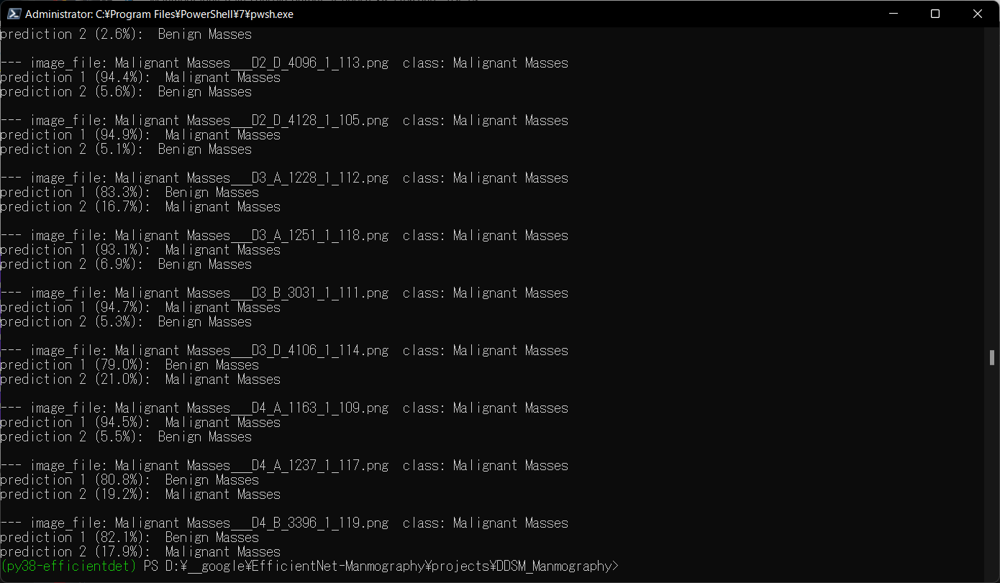 
 
Inference result: 
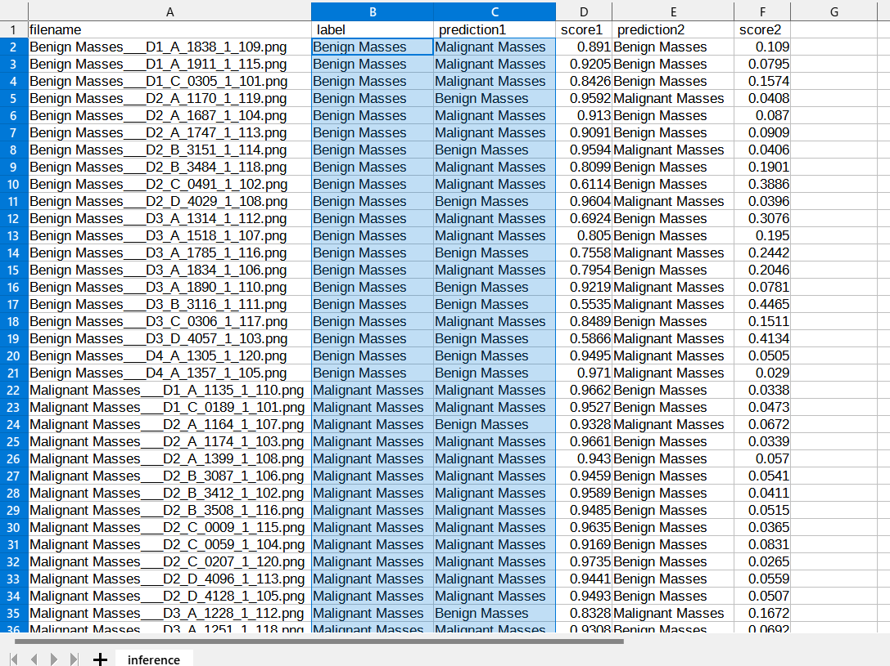 

 
<h2>
<a id="6">6 Evaluation</a>
</h2>
<h3>
<a id="6.1">6.1 Evaluation script</a>
</h3>
Please run the following bat file to evaluate <a href="./projects/DDSM_Mammography/DDSM_Image/test">DDSM_Mammography/DDSM_Image/test</a> by the trained model. 
<pre>
./3_evaluate.bat
</pre>
<pre>
rem 3_evaluate.bat
python ../../EfficientNetV2Evaluator.py ^
  --model_name=efficientnetv2-b0  ^
  --model_dir=./models ^
  --data_dir=./DDSM_Images/test ^
  --evaluation_dir=./evaluation ^
  --fine_tuning=True ^
  --trainable_layers_ratio=0.4 ^
  --dropout_rate=0.4 ^
  --eval_image_size=224 ^
  --label_map=./label_map.txt ^
  --mixed_precision=True ^
  --debug=False 
</pre>

<h3>
<a id="6.2">6.2 Evaluation result</a>
</h3>

This evaluation command will generate <a href="./projects/DDSM_Mammography/evaluation/classification_report.csv">a classification report</a>
 and <a href="./projects/DDSM_Mammography/evaluation/confusion_matrix.png">a confusion_matrix</a>.
 
 
Evaluation console output: 
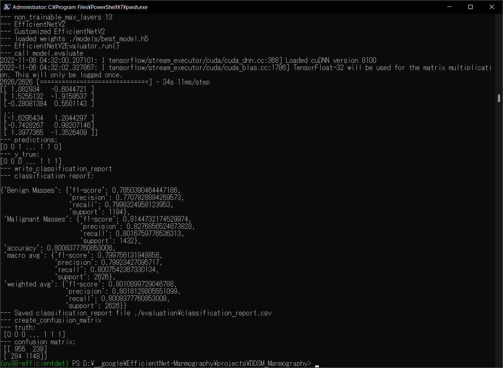 
 

Classification report: 
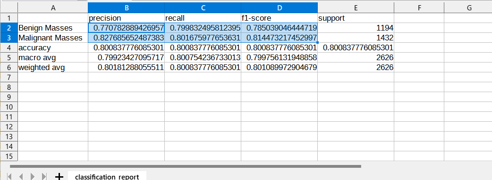 
 
Confusion matrix: 
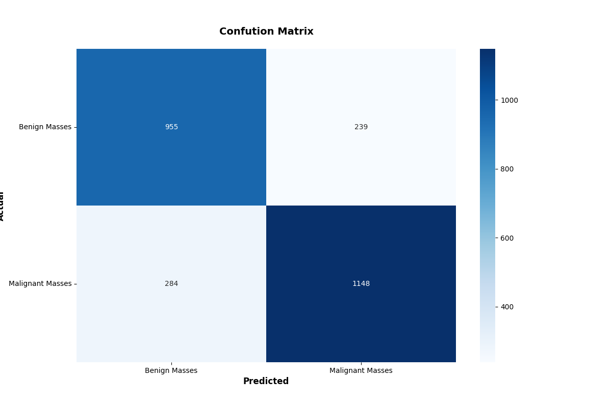 

<h3>References</h3>
<b>
1. Dataset of Breast mammography images with Masses</b> 
<pre>
https://data.mendeley.com/datasets/ywsbh3ndr8/5
</pre>
<b>
2. Deep convolutional neural networks for mammography: advances, challenges and applications</b> 
Dina Abdelhafiz, Clifford Yang, Reda Ammar & Sheida Nabavi  
<pre>
https://bmcbioinformatics.biomedcentral.com/articles/10.1186/s12859-019-2823-4
</pre>
<b>
3. Deep learning in mammography images segmentation and classification: Automated CNN approach</b> 
Author links open overlay panelWessam M.SalamaaMoustafa H.Alyb
<pre>
https://www.sciencedirect.com/science/article/pii/S1110016821002027
</pre>
